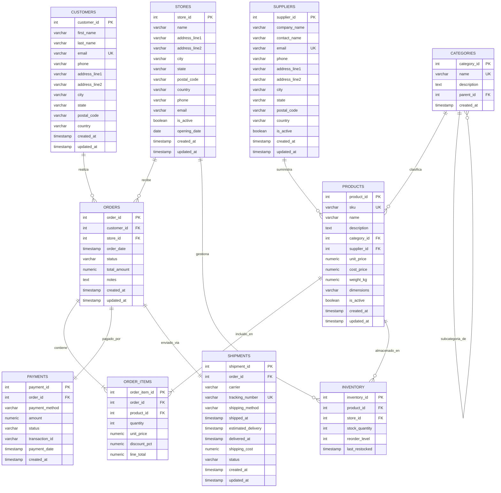

# TechStore Analytics - Diagrama Entidad-Relación

> **Versión:** 1.0.0  
> **Última actualización:** 2025  
> **Motor de base de datos:** PostgreSQL 16  
> **Total de tablas:** 10  
> **Total de vistas:** 6  

---

## 1. Descripción General

El modelo de datos de **TechStore Analytics** está diseñado para soportar las operaciones comerciales de una cadena de tiendas de tecnología, abarcando desde la gestión de clientes y productos hasta el seguimiento de envíos y pagos. El esquema sigue principios de **normalización hasta la 3FN** (Tercera Forma Normal), garantizando la integridad referencial, la eliminación de redundancias y la eficiencia en las consultas analíticas.

El sistema modela un flujo de negocio completo:

```
Clientes → Pedidos → Líneas de Pedido → Productos → Categorías / Proveedores
                    ↳ Pagos
                    ↳ Envíos
Tiendas → Inventario → Productos
```

### Características principales del modelo

- **Integridad referencial** mediante claves foráneas con políticas de borrado explícitas (`CASCADE`, `RESTRICT`, `SET NULL`)
- **Restricciones de dominio** (CHECK constraints) para validar estados, precios positivos y rangos de descuento
- **Snapshot de precios** en `order_items` para preservar el valor histórico al momento de la compra
- **Columna calculada** (`line_total`) en `order_items` usando `GENERATED ALWAYS AS ... STORED`
- **Jerarquía de categorías** mediante auto-referencia (`parent_id`) para soportar subcategorías
- **Soft delete** mediante banderas `is_active` en tablas como `products`, `suppliers` y `stores`
- **Vistas materializadas analíticas** para reportes de ventas, rentabilidad y desempeño

---

## 2. Diagrama Entidad-Relación



---

## 3. Descripción Detallada de Tablas

### 3.1 CUSTOMERS

Almacena la información de perfil de los clientes, incluyendo datos de contacto y dirección completa. Cada cliente puede realizar múltiples pedidos (relación 1:N con `orders`).

| Columna | Tipo | Restricciones | Descripción |
|---------|------|---------------|-------------|
| `customer_id` | `SERIAL` | **PK** | Identificador único del cliente |
| `first_name` | `VARCHAR(100)` | NOT NULL | Nombre(s) del cliente |
| `last_name` | `VARCHAR(100)` | NOT NULL | Apellido(s) del cliente |
| `email` | `VARCHAR(255)` | NOT NULL, **UK**, CHECK (regex email) | Correo electrónico único y validado |
| `phone` | `VARCHAR(30)` | — | Número telefónico |
| `address_line1` | `VARCHAR(255)` | — | Línea 1 de la dirección |
| `address_line2` | `VARCHAR(255)` | — | Línea 2 de la dirección (depto, suite, etc.) |
| `city` | `VARCHAR(100)` | — | Ciudad de residencia |
| `state` | `VARCHAR(100)` | — | Estado o provincia |
| `postal_code` | `VARCHAR(20)` | — | Código postal |
| `country` | `VARCHAR(100)` | DEFAULT 'Mexico' | País de residencia |
| `created_at` | `TIMESTAMP` | DEFAULT CURRENT_TIMESTAMP | Fecha de registro del cliente |
| `updated_at` | `TIMESTAMP` | DEFAULT CURRENT_TIMESTAMP | Última fecha de actualización |

**Restricciones adicionales:**
- `chk_customers_email`: Valida formato de email mediante expresión regular (`^[A-Za-z0-9._%+-]+@[A-Za-z0-9.-]+\.[A-Za-z]{2,}$`)

**Índices:**
- `idx_customers_email` sobre `email` (búsqueda y detección de duplicados)

---

### 3.2 CATEGORIES

Define la jerarquía de clasificación de productos. Soporta subcategorías mediante una auto-referencia al campo `parent_id`.

| Columna | Tipo | Restricciones | Descripción |
|---------|------|---------------|-------------|
| `category_id` | `SERIAL` | **PK** | Identificador único de la categoría |
| `name` | `VARCHAR(100)` | NOT NULL, **UK** | Nombre de la categoría (ej: 'Laptops', 'Smartphones') |
| `description` | `TEXT` | — | Descripción libre de la categoría |
| `parent_id` | `INTEGER` | **FK** → `categories(category_id)`, ON DELETE SET NULL | Categoría padre (para subcategorías) |
| `created_at` | `TIMESTAMP` | DEFAULT CURRENT_TIMESTAMP | Fecha de creación |

**Restricciones adicionales:**
- `chk_categories_not_self_parent`: Impide que una categoría sea su propio padre (`parent_id IS NULL OR parent_id <> category_id`)

**Nota:** La auto-referencia `parent_id` permite modelar jerarquías de profundidad arbitraria (ej: Electrónica → Computación → Laptops → Gaming).

---

### 3.3 SUPPLIERS

Información de proveedores y fabricantes para el seguimiento de la cadena de suministro y costos.

| Columna | Tipo | Restricciones | Descripción |
|---------|------|---------------|-------------|
| `supplier_id` | `SERIAL` | **PK** | Identificador único del proveedor |
| `company_name` | `VARCHAR(200)` | NOT NULL | Nombre legal o comercial de la empresa |
| `contact_name` | `VARCHAR(150)` | — | Persona de contacto principal |
| `email` | `VARCHAR(255)` | NOT NULL, **UK**, CHECK (regex email) | Correo electrónico del proveedor |
| `phone` | `VARCHAR(30)` | — | Teléfono del proveedor |
| `address_line1` | `VARCHAR(255)` | — | Línea 1 de la dirección |
| `address_line2` | `VARCHAR(255)` | — | Línea 2 de la dirección |
| `city` | `VARCHAR(100)` | — | Ciudad |
| `state` | `VARCHAR(100)` | — | Estado o provincia |
| `postal_code` | `VARCHAR(20)` | — | Código postal |
| `country` | `VARCHAR(100)` | DEFAULT 'Mexico' | País de operación |
| `is_active` | `BOOLEAN` | DEFAULT TRUE | Borrado lógico (soft delete) |
| `created_at` | `TIMESTAMP` | DEFAULT CURRENT_TIMESTAMP | Fecha de registro |
| `updated_at` | `TIMESTAMP` | DEFAULT CURRENT_TIMESTAMP | Última actualización |

**Restricciones adicionales:**
- `chk_suppliers_email`: Validación de formato de email
- La bandera `is_active` permite desactivar proveedores sin eliminar registros históricos asociados

---

### 3.4 PRODUCTS

Catálogo de productos con información de precios, costos y clasificación. El `sku` es único y el precio de venta debe ser mayor al costo (margen positivo).

| Columna | Tipo | Restricciones | Descripción |
|---------|------|---------------|-------------|
| `product_id` | `SERIAL` | **PK** | Identificador único del producto |
| `sku` | `VARCHAR(50)` | NOT NULL, **UK** | Código SKU único (Stock Keeping Unit) |
| `name` | `VARCHAR(255)` | NOT NULL | Nombre de presentación del producto |
| `description` | `TEXT` | — | Descripción detallada del producto |
| `category_id` | `INTEGER` | NOT NULL, **FK** → `categories(category_id)`, ON DELETE RESTRICT | Categoría a la que pertenece |
| `supplier_id` | `INTEGER` | **FK** → `suppliers(supplier_id)`, ON DELETE SET NULL | Proveedor del producto |
| `unit_price` | `NUMERIC(12,2)` | NOT NULL, CHECK (> 0) | Precio de venta al público |
| `cost_price` | `NUMERIC(12,2)` | NOT NULL, CHECK (>= 0) | Costo de adquisición |
| `weight_kg` | `NUMERIC(8,3)` | — | Peso en kilogramos |
| `dimensions` | `VARCHAR(50)` | — | Dimensiones en formato 'LxWxH' (cm) |
| `is_active` | `BOOLEAN` | DEFAULT TRUE | Borrado lógico (soft delete) |
| `created_at` | `TIMESTAMP` | DEFAULT CURRENT_TIMESTAMP | Fecha de alta en el catálogo |
| `updated_at` | `TIMESTAMP` | DEFAULT CURRENT_TIMESTAMP | Última actualización |

**Restricciones adicionales:**
- `chk_products_price_positive`: El precio de venta debe ser mayor a 0
- `chk_products_cost_positive`: El costo debe ser mayor o igual a 0
- `chk_products_margin`: El precio de venta debe ser mayor al costo (margen positivo garantizado)

**Índices:**
- `idx_products_sku` sobre `sku` (búsqueda rápida por código de barras)
- `idx_products_category_id` sobre `category_id` (filtrado por categoría)

**Nota de diseño:** La política `ON DELETE RESTRICT` en `category_id` impide eliminar una categoría que tenga productos asignados, protegiendo la integridad de los datos analíticos.

---

### 3.5 STORES

Localizaciones físicas de las tiendas de la cadena. Cada tienda mantiene su propio inventario y procesa sus propios pedidos.

| Columna | Tipo | Restricciones | Descripción |
|---------|------|---------------|-------------|
| `store_id` | `SERIAL` | **PK** | Identificador único de la tienda |
| `name` | `VARCHAR(200)` | NOT NULL | Nombre de la tienda |
| `address_line1` | `VARCHAR(255)` | NOT NULL | Línea 1 de la dirección |
| `address_line2` | `VARCHAR(255)` | — | Línea 2 de la dirección |
| `city` | `VARCHAR(100)` | NOT NULL | Ciudad donde se ubica |
| `state` | `VARCHAR(100)` | — | Estado o provincia |
| `postal_code` | `VARCHAR(20)` | — | Código postal |
| `country` | `VARCHAR(100)` | DEFAULT 'Mexico' | País |
| `phone` | `VARCHAR(30)` | — | Teléfono de la tienda |
| `email` | `VARCHAR(255)` | — | Correo electrónico de la tienda |
| `is_active` | `BOOLEAN` | DEFAULT TRUE | Borrado lógico (tierra temporalmente cerrada) |
| `opening_date` | `DATE` | — | Fecha de inauguración |
| `created_at` | `TIMESTAMP` | DEFAULT CURRENT_TIMESTAMP | Fecha de registro |
| `updated_at` | `TIMESTAMP` | DEFAULT CURRENT_TIMESTAMP | Última actualización |

---

### 3.6 INVENTORY

Tabla de intersección que registra los niveles de stock por producto y por tienda (relación M:N entre `products` y `stores`). Garantiza un único registro de inventario por par producto-tienda.

| Columna | Tipo | Restricciones | Descripción |
|---------|------|---------------|-------------|
| `inventory_id` | `SERIAL` | **PK** | Identificador único del registro |
| `product_id` | `INTEGER` | NOT NULL, **FK** → `products(product_id)`, ON DELETE CASCADE | Producto en inventario |
| `store_id` | `INTEGER` | NOT NULL, **FK** → `stores(store_id)`, ON DELETE CASCADE | Tienda donde se almacena |
| `stock_quantity` | `INTEGER` | NOT NULL, DEFAULT 0, CHECK (>= 0) | Cantidad actual en stock |
| `reorder_level` | `INTEGER` | NOT NULL, DEFAULT 10, CHECK (> 0) | Nivel mínimo para reorden |
| `last_restocked` | `TIMESTAMP` | — | Fecha de la última reposición |

**Restricciones adicionales:**
- `uq_inventory_product_store`: Restricción UNIQUE compuesta sobre `(product_id, store_id)`, evita duplicados
- `chk_inventory_stock_nonneg`: El stock no puede ser negativo
- `chk_inventory_reorder_pos`: El nivel de reorden debe ser mayor a 0

**Índices:**
- `idx_inventory_product_id` sobre `product_id`
- `idx_inventory_store_id` sobre `store_id`
- `idx_inventory_stock_quantity` — Índice parcial sobre `stock_quantity WHERE stock_quantity <= reorder_level` (optimiza alertas de stock bajo)

---

### 3.7 ORDERS

Cabeceras de pedidos de clientes con seguimiento de estado. Cada pedido pertenece a un cliente y se procesa en una tienda específica.

| Columna | Tipo | Restricciones | Descripción |
|---------|------|---------------|-------------|
| `order_id` | `SERIAL` | **PK** | Identificador único del pedido |
| `customer_id` | `INTEGER` | NOT NULL, **FK** → `customers(customer_id)`, ON DELETE RESTRICT | Cliente que realizó el pedido |
| `store_id` | `INTEGER` | NOT NULL, **FK** → `stores(store_id)`, ON DELETE RESTRICT | Tienda donde se procesó |
| `order_date` | `TIMESTAMP` | NOT NULL, DEFAULT CURRENT_TIMESTAMP | Fecha y hora del pedido |
| `status` | `VARCHAR(20)` | NOT NULL, DEFAULT 'pending', CHECK (enum) | Estado del pedido |
| `total_amount` | `NUMERIC(12,2)` | NOT NULL, DEFAULT 0, CHECK (>= 0) | Monto total del pedido |
| `notes` | `TEXT` | — | Notas o comentarios del pedido |
| `created_at` | `TIMESTAMP` | DEFAULT CURRENT_TIMESTAMP | Fecha de creación del registro |
| `updated_at` | `TIMESTAMP` | DEFAULT CURRENT_TIMESTAMP | Última actualización |

**Workflow de estados:**

```
pending → confirmed → processing → shipped → delivered
                                              ↘ cancelled (desde cualquier estado)
```

**Valores permitidos para `status`:** `pending`, `confirmed`, `processing`, `shipped`, `delivered`, `cancelled`

**Restricciones adicionales:**
- `chk_orders_status`: Valida que el estado sea uno de los valores permitidos
- `chk_orders_total_nonneg`: El monto total no puede ser negativo

**Índices:**
- `idx_orders_order_date` — Reportes por rango de fechas
- `idx_orders_customer_id` — Historial de pedidos por cliente
- `idx_orders_store_id` — Agregaciones por tienda
- `idx_orders_status` — Filtrado por estado (colas de trabajo)
- `idx_orders_date_status` — Índice compuesto para reportes mensuales excluyendo cancelados

---

### 3.8 ORDER_ITEMS

Líneas de detalle dentro de cada pedido. Cada línea referencia un producto específico y captura el precio unitario al momento de la compra (**snapshot de precio**), lo que evita que cambios de precio alteren los totales históricos.

| Columna | Tipo | Restricciones | Descripción |
|---------|------|---------------|-------------|
| `order_item_id` | `SERIAL` | **PK** | Identificador único de la línea |
| `order_id` | `INTEGER` | NOT NULL, **FK** → `orders(order_id)`, ON DELETE CASCADE | Pedido al que pertenece |
| `product_id` | `INTEGER` | NOT NULL, **FK** → `products(product_id)`, ON DELETE RESTRICT | Producto ordenado |
| `quantity` | `INTEGER` | NOT NULL, CHECK (> 0) | Cantidad ordenada |
| `unit_price` | `NUMERIC(12,2)` | NOT NULL, CHECK (> 0) | Precio unitario al momento de la compra (snapshot) |
| `discount_pct` | `NUMERIC(5,2)` | DEFAULT 0, CHECK (0-100) | Porcentaje de descuento aplicado |
| `line_total` | `NUMERIC(12,2)` | GENERATED ALWAYS AS (computed) STORED | Total de la línea (calculado automáticamente) |

**Fórmula de `line_total`:**

```sql
line_total = quantity * unit_price * (1 - COALESCE(discount_pct, 0) / 100)
```

**Restricciones adicionales:**
- `chk_order_items_qty_positive`: La cantidad debe ser mayor a 0
- `chk_order_items_price_positive`: El precio unitario debe ser mayor a 0
- `chk_order_items_discount_range`: El descuento debe estar entre 0 y 100

**Índices:**
- `idx_order_items_order_id` — Detalle de un pedido específico
- `idx_order_items_product_id` — Agregación de ventas por producto
- `idx_order_items_product_order` — Índice compuesto para consultas de ventas con contexto de pedido

**Nota de diseño:** La columna `line_total` es una **columna generada** (computed column) que se calcula automáticamente por PostgreSQL. Esto garantiza consistencia y elimina la posibilidad de errores de cálculo.

---

### 3.9 PAYMENTS

Registros de pago vinculados a pedidos. Soporta múltiples métodos de pago y realiza un seguimiento independiente del estado del pago respecto al estado del pedido.

| Columna | Tipo | Restricciones | Descripción |
|---------|------|---------------|-------------|
| `payment_id` | `SERIAL` | **PK** | Identificador único del pago |
| `order_id` | `INTEGER` | NOT NULL, **FK** → `orders(order_id)`, ON DELETE CASCADE | Pedido asociado (1:1) |
| `payment_method` | `VARCHAR(30)` | NOT NULL, CHECK (enum) | Método de pago utilizado |
| `amount` | `NUMERIC(12,2)` | NOT NULL, CHECK (> 0) | Monto del pago |
| `status` | `VARCHAR(20)` | NOT NULL, DEFAULT 'pending', CHECK (enum) | Estado del pago |
| `transaction_id` | `VARCHAR(100)` | — | Referencia externa del gateway de pago |
| `payment_date` | `TIMESTAMP` | DEFAULT CURRENT_TIMESTAMP | Fecha y hora del pago |
| `created_at` | `TIMESTAMP` | DEFAULT CURRENT_TIMESTAMP | Fecha de creación del registro |

**Valores permitidos para `payment_method`:** `credit_card`, `debit_card`, `cash`, `bank_transfer`, `paypal`, `stripe`, `other`

**Valores permitidos para `status`:** `pending`, `completed`, `failed`, `refunded`

**Restricciones adicionales:**
- `chk_payments_method`: Valida método de pago contra lista permitida
- `chk_payments_status`: Valida estado contra lista permitida
- `chk_payments_amount_positive`: El monto debe ser mayor a 0

**Índices:**
- `idx_payments_payment_method` — Análisis de distribución de métodos de pago

**Relación 1:1:** Cada pedido tiene exactamente un registro de pago. Esto se refleja en el modelo ORM mediante `uselist=False` y la restricción `unique=True` en `order_id`.

---

### 3.10 SHIPMENTS

Seguimiento de envíos para pedidos entregados. Cada envío está vinculado a un pedido y rastrea el transportista, número de seguimiento y fechas del proceso logístico.

| Columna | Tipo | Restricciones | Descripción |
|---------|------|---------------|-------------|
| `shipment_id` | `SERIAL` | **PK** | Identificador único del envío |
| `order_id` | `INTEGER` | NOT NULL, **FK** → `orders(order_id)`, ON DELETE CASCADE | Pedido asociado (1:1) |
| `carrier` | `VARCHAR(100)` | NOT NULL | Empresa de transporte |
| `tracking_number` | `VARCHAR(100)` | NOT NULL, **UK** | Número de rastreo único |
| `shipping_method` | `VARCHAR(50)` | DEFAULT 'standard' | Método de envío (standard, express, overnight) |
| `shipped_at` | `TIMESTAMP` | — | Fecha de entrega al transportista |
| `estimated_delivery` | `TIMESTAMP` | — | Fecha estimada de entrega |
| `delivered_at` | `TIMESTAMP` | — | Fecha real de entrega al cliente |
| `shipping_cost` | `NUMERIC(10,2)` | DEFAULT 0, CHECK (>= 0) | Costo de envío |
| `status` | `VARCHAR(20)` | NOT NULL, DEFAULT 'pending', CHECK (enum) | Estado del envío |
| `created_at` | `TIMESTAMP` | DEFAULT CURRENT_TIMESTAMP | Fecha de creación del registro |
| `updated_at` | `TIMESTAMP` | DEFAULT CURRENT_TIMESTAMP | Última actualización |

**Workflow de estados:**

```
pending → picked_up → in_transit → out_for_delivery → delivered
                                                           ↘ returned
```

**Valores permitidos para `status`:** `pending`, `picked_up`, `in_transit`, `out_for_delivery`, `delivered`, `returned`

**Restricciones adicionales:**
- `chk_shipments_status`: Valida estado contra lista permitida
- `chk_shipments_cost_nonneg`: El costo de envío no puede ser negativo

**Índices:**
- `idx_shipments_tracking_number` — Búsqueda rápida por número de rastreo

**Relación 1:1:** Cada pedido tiene exactamente un registro de envío, implementado con `uselist=False` y `unique=True` en `order_id`.

---

## 4. Descripción de Relaciones

### 4.1 Resumen de Cardinalidades

| Relación | Padre | Hijo | Cardinalidad | ON DELETE | Descripción |
|----------|-------|------|-------------|-----------|-------------|
| 1 | `CUSTOMERS` | `ORDERS` | 1:N | RESTRICT | Un cliente puede realizar muchos pedidos |
| 2 | `STORES` | `ORDERS` | 1:N | RESTRICT | Una tienda procesa muchos pedidos |
| 3 | `ORDERS` | `ORDER_ITEMS` | 1:N | CASCADE | Un pedido contiene muchas líneas de detalle |
| 4 | `PRODUCTS` | `ORDER_ITEMS` | 1:N | RESTRICT | Un producto aparece en muchas líneas de pedido |
| 5 | `CATEGORIES` | `PRODUCTS` | 1:N | RESTRICT | Una categoría clasifica muchos productos |
| 6 | `SUPPLIERS` | `PRODUCTS` | 1:N | SET NULL | Un proveedor suministra muchos productos |
| 7 | `STORES` | `INVENTORY` | 1:N | CASCADE | Una tienda gestiona muchos registros de inventario |
| 8 | `PRODUCTS` | `INVENTORY` | 1:N | CASCADE | Un producto tiene inventario en múltiples tiendas |
| 9 | `ORDERS` | `PAYMENTS` | 1:1 | CASCADE | Cada pedido tiene exactamente un pago |
| 10 | `ORDERS` | `SHIPMENTS` | 1:1 | CASCADE | Cada pedido tiene exactamente un envío |
| 11 | `CATEGORIES` | `CATEGORIES` | 1:N | SET NULL | Una categoría puede tener subcategorías (auto-referencia) |

### 4.2 Detalle de Políticas de Borrado

- **CASCADE**: Al eliminar el registro padre, se eliminan automáticamente los registros hijos. Usado en relaciones fuertemente dependientes (`orders → order_items`, `orders → payments`, `orders → shipments`, `stores → inventory`, `products → inventory`).
- **RESTRICT**: Impide eliminar el registro padre si existen registros hijos referenciándolo. Usado cuando los datos hijos tienen valor analítico histórico (`customers → orders`, `products → order_items`, `categories → products`).
- **SET NULL**: Al eliminar el registro padre, se establece a NULL la clave foránea en los hijos. Usado cuando la relación es opcional y no afecta la integridad (`suppliers → products`, `categories → categories`).

---

## 5. Vistas Analíticas

El esquema incluye 6 vistas predefinidas para consultas analíticas comunes:

| Vista | Propósito | Tablas involucradas |
|-------|-----------|-------------------|
| `monthly_sales_summary` | Tendencias de ventas mensuales | `orders` |
| `top_customers` | Ranking de clientes por gasto | `customers`, `orders` |
| `inventory_status` | Clasificación de niveles de stock | `inventory`, `products`, `stores` |
| `category_sales_summary` | Rendimiento por categoría | `categories`, `products`, `order_items`, `orders` |
| `product_profitability` | Margen de ganancia por producto | `products`, `categories`, `order_items`, `orders` |
| `store_performance` | KPIs por tienda | `stores`, `orders` |

---

## 6. Notas sobre Normalización

### 6.1 Primera Forma Normal (1FN)

Todas las tablas cumplen con la 1FN:
- Todos los atributos son atómicos (no hay listas ni conjuntos en una sola columna)
- Cada fila es única (claves primarias definidas en todas las tablas)
- No existen columnas repetitivas (`address_line1` y `address_line2` son semánticamente distintas, no repetitivas)

### 6.2 Segunda Forma Normal (2FN)

Todas las tablas cumplen con la 2FN:
- Al utilizar claves primarias simples (un solo columna `SERIAL`), no existen dependencias parciales
- Cada atributo no-clave depende de la clave primaria completa

### 6.3 Tercera Forma Normal (3FN)

Todas las tablas cumplen con la 3FN:
- No existen dependencias transitivas entre atributos no-clave
- La columna `line_total` en `order_items` es una excepción aparente (depende de `quantity`, `unit_price` y `discount_pct`), pero está justificada como **columna generada almacenada** por razones de rendimiento en consultas analíticas, y su valor es siempre consistente con la fórmula definida

### 6.4 Desnormalizaciones Intencionales

Las siguientes desnormalizaciones fueron aplicadas estratégicamente para optimizar el rendimiento analítico:

| Desnormalización | Tabla | Justificación |
|-----------------|-------|---------------|
| `line_total` (columna generada) | `order_items` | Evita recalcular en cada consulta; se mantiene automáticamente por PostgreSQL |
| `total_amount` en `orders` | `orders` | Facilita consultas de resumen sin JOIN con `order_items`; debe mantenerse sincronizado |
| Dirección completa en `customers` y `suppliers` | Múltiples | Evita JOINs con tabla de direcciones para consultas frecuentes de contacto |

### 6.5 Índices Estratégicos

Se han definido **15 índices** optimizados para los patrones de acceso identificados:

- **10 índices simples** para búsquedas por clave foránea y columnas únicas
- **4 índices compuestos** para consultas multi-columna (ej: fecha + estado)
- **1 índice parcial** (`idx_inventory_stock_quantity WHERE stock_quantity <= reorder_level`) para alertas de stock bajo, reduciendo el tamaño del índice al incluir solo filas relevantes

---

## 7. Correspondencia SQL ↔ ORM

La siguiente tabla muestra la correspondencia entre el esquema SQL (en `sql/schema.sql`) y los modelos SQLAlchemy (en `app/models/models.py`):

| Tabla SQL | Modelo ORM | Notas |
|-----------|-----------|-------|
| `customers` | `Customer` | Columna `id` en ORM ↔ `customer_id` en SQL |
| `categories` | `Category` | Auto-referencia `parent_id` solo en SQL |
| `suppliers` | `Supplier` | ORM simplificado (menos columnas de dirección) |
| `products` | `Product` | `price`/`cost` en ORM ↔ `unit_price`/`cost_price` en SQL |
| `stores` | `Store` | ORM simplificado (columnas principales) |
| `inventory` | `Inventory` | Restricción UNIQUE compuesta en ambos |
| `orders` | `Order` | Relaciones 1:1 con Payment y Shipment via `uselist=False` |
| `order_items` | `OrderItem` | `discount` en ORM ↔ `discount_pct` en SQL |
| `payments` | `Payment` | `payment_status` en ORM ↔ `status` en SQL |
| `shipments` | `Shipment` | `shipment_status` en ORM ↔ `status` en SQL |

---

## 8. Migraciones

El proyecto utiliza **Alembic** como herramienta de migración de base de datos. La configuración se encuentra en:

- `alembic.ini` — Configuración principal (URL de conexión)
- `alembic/env.py` — Configuración del entorno de migración
- `alembic/versions/` — Scripts de migración generados

Para generar una nueva migración:

```bash
alembic revision --autogenerate -m "descripción_del_cambio"
```

Para aplicar migraciones pendientes:

```bash
alembic upgrade head
```

---

> **Documento generado para el proyecto TechStore Analytics**  
> **Stack tecnológico:** FastAPI + SQLAlchemy + PostgreSQL + Alembic  
> **Licencia:** Proyecto de portafolio
